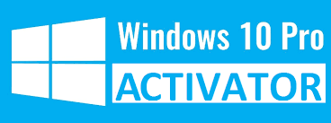
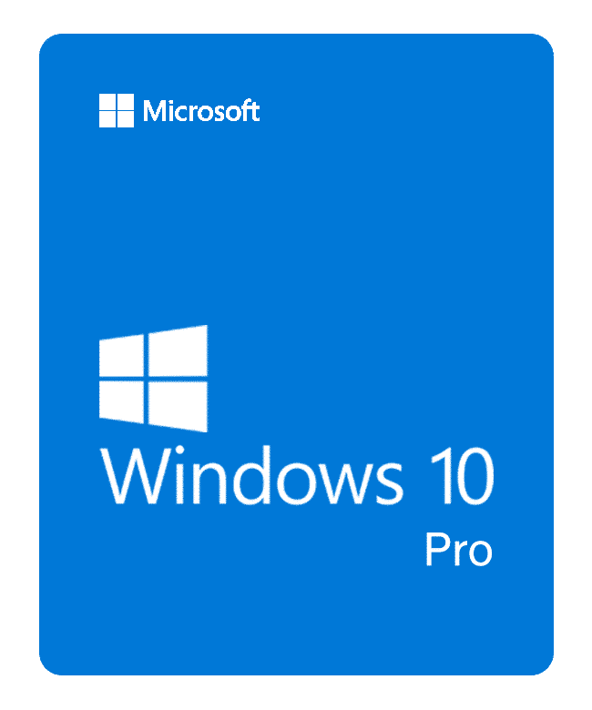

                                                     
# Activate "Windows 10 Professional" for Free 

> To remove this repo please create an issue with valid reason

 

 

## Activation Steps [2]

### Step 1/2] Download 'activator script' from direct download links given below :

- Batch file : [.bat](https://github.com/Divinemonk/win10pro/releases/download/activator/win10pro.bat)
- Zip file   : [.zip](https://github.com/Divinemonk/win10pro/archive/refs/tags/activator.zip)
- Tar file   : [.tar.gz](https://github.com/Divinemonk/win10pro/archive/refs/tags/activator.tar.gz)
> Click file extension to start downloading | Check [Releases](https://github.com/Divinemonk/win10pro/releases)

 

### Step 2/2] Run File as Administrator

- Unzip the file if downloaded in `.zip` or `.tar.gz` format. (Skip if you have directly downloaded `.bat` file)
- Verify the `sha1` / `md5` sum of files given in `Disclaimer` below
- Right click ` win10pro.bat ` file and select on `run as administrator ` option
- Wait until the process is completed in `cmd`

 

### Your Windows 10 Professional is activated !!

 

<!-- &nbsp; 1
&ensp; 2
&emsp; 4
 -->
 
## Details

  
About Script

  &ensp; <pre> The script to activate is written in 'Batch Files' (.bat extension) </pre>
   

  
Prerequisites

  &ensp; <pre> "Windows 10 Pro"  installed as main Operating System / as Virtual Machine </pre>
  &ensp; <pre> Administrative privileges to run the file and activate windows </pre>
   

 

### :warning: Disclaimer 

- It is *safe* to run script as *administrator*, just verify the sha1sum / md5sum of the `.bat` file downloaded from below :-
- sha1 : `2b8fa42441962ae1f58618fee2fec6a90bcee548`
- md5 : `86d7867ad6fab5e4eb7b73070dae4ffa`

 
